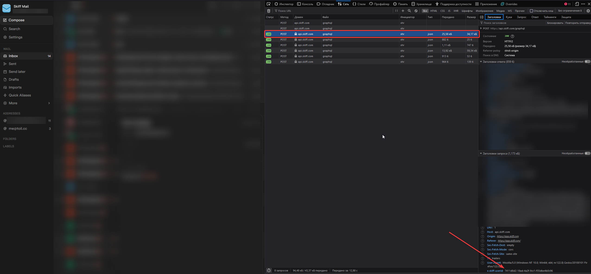
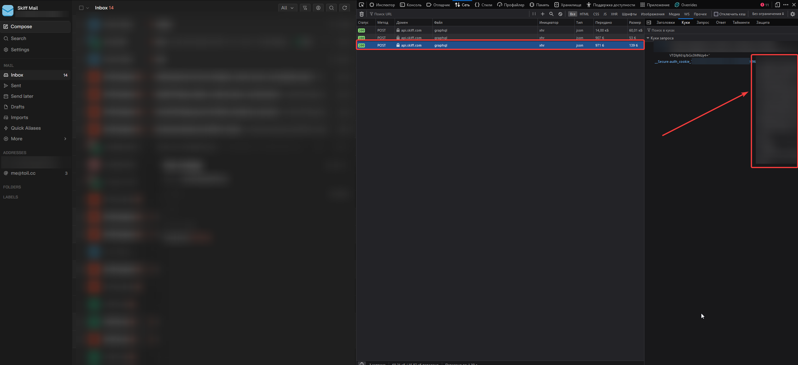
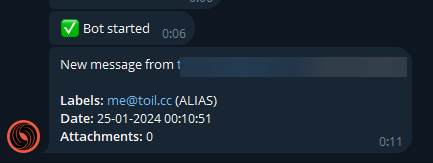

## skiff2tg

skiff2tg - this is a small script that sends notifications to Telegram about new emails in the mail [skiff.com](https://skiff.com)

### Installation
1. Clone this repository
2. Install [Python 3.11](https://www.python.org/)
3. Install dependencies:
```bash
pip install -r requirements.txt
```
4. Copy `.example.env` and rename it to `.env`
5. Fill in `.env`:

`BOT_TOKEN` - Telegram bot token

`CHAT_ID` - Telegram chat ID

`SKIFF_USERID` - Your skiff user ID. Copy from the request headers to `/graphql` (you must be logged in and located in the [mail](https://app.skiff.com/mail/inbox))


`SKIFF_SECURE` - Your skiff JWT token. Copy from the request headers to `/graphql` (you must be logged in and located in the [mail](https://app.skiff.com/mail/inbox))


6. Run `main.py`

### Preview

